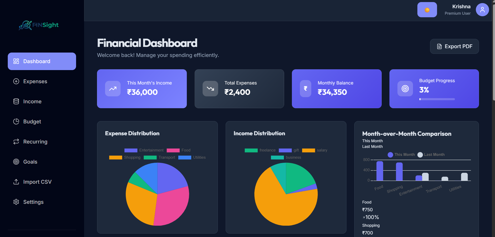
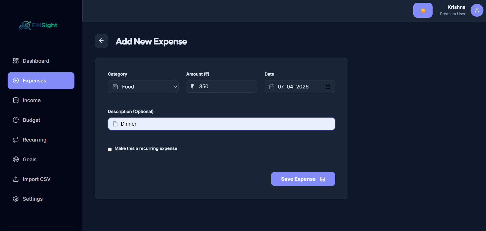
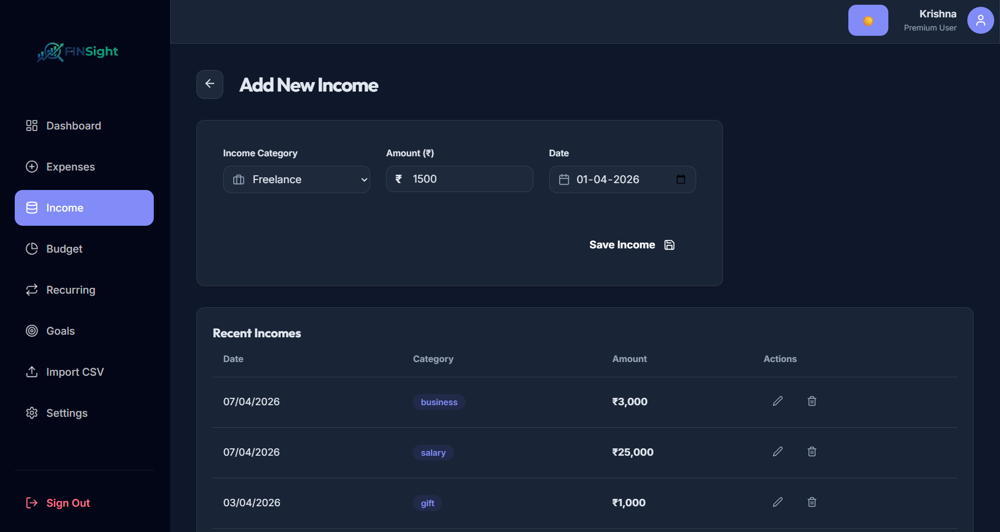
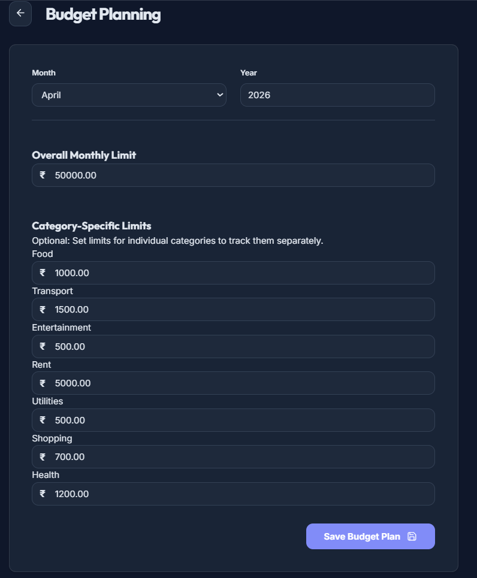
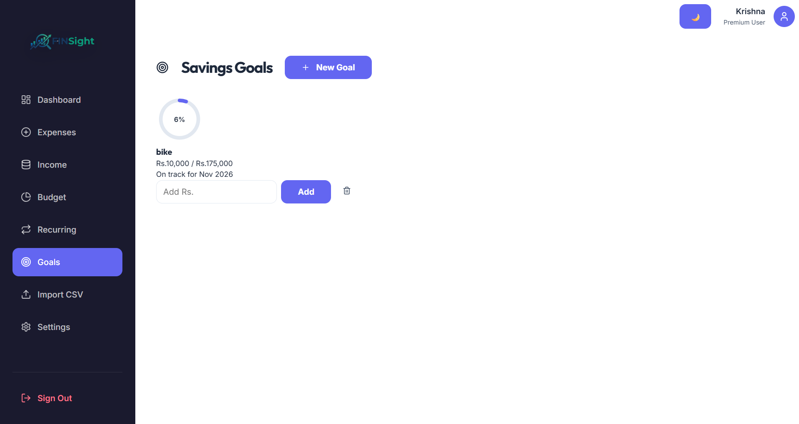
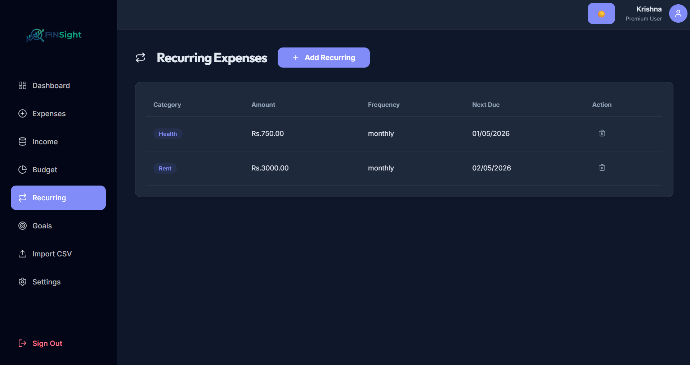
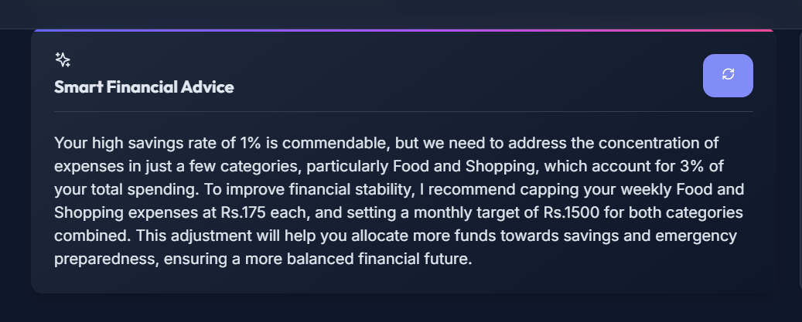
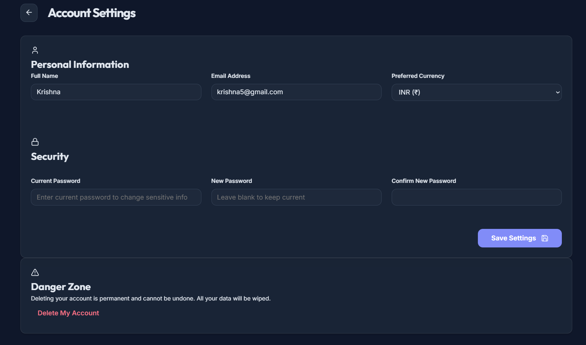

# 💰 FinSight – Intelligent Personal Finance Management System

## 🚀 Project Overview
**FinSight** is a modern full-stack personal finance web application designed to help users **track, analyze, and improve their financial habits**.

Unlike traditional expense trackers, FinSight goes beyond simple transaction logging by integrating **budget planning, recurring expense automation, savings goal tracking, and AI-powered financial insights**.

The platform provides a **clean dashboard with real-time analytics**, enabling users to clearly understand their income, spending patterns, and overall financial health.

---

## ✨ FinSight Solution
FinSight provides a complete financial management system:

- 📊 Smart Dashboard with real-time analytics  
- 🏷 Category-based expense & income tracking  
- 📈 Budget management with alerts  
- 🔁 Recurring expense automation  
- 🎯 Savings goal tracking  
- 📂 CSV/XLSX transaction import  
- 📄 PDF export reports  
- 🤖 AI-based financial advice  
- 📱 Fully responsive design  

---

## 🛠 Tech Stack

| Category | Technologies |
|----------|------------|
| Frontend | React (Vite), React Router, Axios |
| UI & Charts | Chart.js, react-chartjs-2, Lucide Icons, react-hot-toast |
| Backend | Node.js, Express.js |
| Database | MySQL (mysql2) |
| Authentication | JWT, Bcrypt |
| File Handling | Multer, CSV Parser, XLSX |
| Automation | Node-cron |
| AI Integration | Gemini, OpenRouter, Groq, OpenAI |
| Deployment | Vercel, Railway |

---

## 📸 Screenshots & Features

### 📊 Dashboard

**Role:**  
Provides an overview of total income, expenses, balance, and budget usage.  
Helps users quickly understand their financial status.

---

### 💸 Expense Management

**Role:**  
Allows users to add, categorize, and track expenses.  
Supports filtering by date and category for better insights.

---

### 💰 Income Tracking

**Role:**  
Records all income sources and displays monthly income trends.  
Helps users compare earnings vs spending.

---

### 📈 Budget Planning

**Role:**  
Users can set monthly budgets and monitor usage.  
Alerts users when spending approaches limits.

---

### 🎯 Savings Goals

**Role:**  
Allows users to define financial goals (e.g., saving money).  
Tracks progress visually to motivate users.

---

### 🔁 Recurring Expenses

**Role:**  
Automates repeated expenses like rent or subscriptions.  
Handled using backend cron jobs.

---

### 🤖 Smart Financial Advice

**Role:**  
Generates personalized financial advice based on user data.  
Uses AI providers to give actionable suggestions.

---

### ⚙️ Account Settings

**Role:**  
Allows users to manage profile, preferences, and account security.

---

### 🌐 Full Application View

**Role:**  
Shows the complete UI design and overall system flow.

---

## 🌟 Why This Project Stands Out

- Combines **Finance + AI (high-demand skill)**  
- Real-world full-stack implementation  
- Includes automation (recurring transactions)  
- AI-powered personalized insights  
- Clean and responsive UI  
- Fully deployed production-ready system  

---

## 🔮 Future Improvements

- AI-based expense prediction  
- Voice-based financial assistant  
- Investment tracking module  
- Multi-user shared budgeting  
- Mobile application  

---

## 👨‍💻 Author

**Krishnakant Shivaji Gunjal**

- GitHub: https://github.com/krishnakantgunjal  
- LinkedIn: https://www.linkedin.com/in/krishnakant-gunjal/  

---
